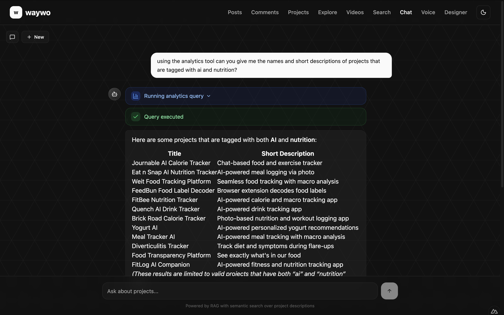
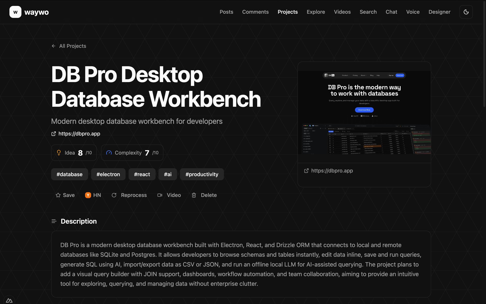
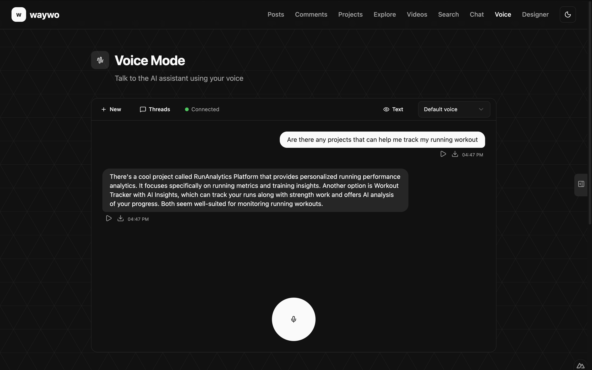

# Waywo


A searchable, AI-powered index of projects from Hacker News ["What are you working on?"](https://news.ycombinator.com/) monthly threads. Waywo collects posts and comments from these threads, uses LLM-powered workflows to extract and enrich project data, and provides semantic search, a RAG chatbot, and voice interaction to explore what the HN community is building.

> **Documentation**: [briancaffey.github.io/waywo](https://briancaffey.github.io/waywo)

## Features

### AI-Powered Project Extraction

Comments from HN threads are processed through a multi-step [LlamaIndex](https://www.llamaindex.ai/) workflow that extracts individual projects, validates them, fetches and summarizes linked URLs, generates metadata (tags, scores, descriptions), and creates vector embeddings for search.

### Semantic Search & RAG Chatbot

Search across thousands of extracted projects using vector similarity with reranking. Ask natural language questions about projects through the RAG chatbot, which retrieves relevant context and generates grounded responses with source citations.



### Project Explorer

Browse, filter, and bookmark extracted projects. Each project includes AI-generated descriptions, idea/complexity scores, hashtags, screenshots, similar project recommendations, and links back to the original HN comment.



### Voice Interface

Talk to the AI assistant using your voice. Speech-to-text and text-to-speech powered by NVIDIA NeMo models enable a conversational experience for discovering projects.



## Tech Stack

| Layer | Technology |
|-------|-----------|
| **Backend** | Python, FastAPI, Celery, SQLAlchemy |
| **Frontend** | Nuxt 4, Vue 3, shadcn-vue, Tailwind CSS |
| **Database** | SQLite + sqlite-vec for vector search |
| **Task Queue** | Celery + Redis (broker) |
| **AI/ML** | LlamaIndex, NVIDIA Nemotron (LLM, embeddings, reranking, STT, TTS, content safety) |
| **Web Scraping** | Firecrawl |
| **Screenshots** | Playwright + Chromium |
| **Observability** | Arize Phoenix (OpenTelemetry tracing) |
| **Containerization** | Docker Compose |

## Architecture

The application runs as a set of Docker Compose services:

- **Backend API** (FastAPI) - REST API for all data and AI operations
- **Celery Worker** - Async task processing for comment extraction, embeddings, screenshots
- **Celery Beat** - Scheduled task runner
- **Redis** - Celery broker and result backend
- **Jupyter Lab** - Interactive notebooks for exploration and development
- **Phoenix** - LLM observability and trace visualization
- **Flower** - Celery task monitoring

External self-hosted AI services:

- **Nemotron LLM** - Project extraction, metadata generation, chatbot responses
- **Embedding Service** - Vector embeddings for semantic search
- **Rerank Service** - Cross-encoder reranking for improved search relevance
- **Speech-to-Text** - Voice input transcription
- **Text-to-Speech** - Voice output synthesis
- **Content Safety** - Input moderation and safety filtering

## Getting Started

### Prerequisites

- Docker and Docker Compose
- Access to NVIDIA Nemotron model endpoints (LLM, embedding, rerank)
- Firecrawl instance for web scraping

### Running

```bash
docker compose up -d
```

### Services

| Service | URL |
|---------|-----|
| Frontend | http://localhost:3000 |
| Backend API | http://localhost:8008 |
| API Docs (Swagger) | http://localhost:8008/docs |
| Flower (Celery monitoring) | http://localhost:5555 |
| Phoenix (LLM tracing) | http://localhost:6006 |
| Jupyter Lab | http://localhost:8888 |
| Redis Insights | http://localhost:7001 |

### Development

```bash
# Format code
make black

# Check formatting
make check
```

## Documentation

Full documentation is available at [briancaffey.github.io/waywo](https://briancaffey.github.io/waywo), covering:

- Getting started and quickstart guide
- Architecture and data model
- AI model configuration
- Data pipeline and workflow details
- Search, RAG, and chatbot internals
- Frontend pages and components
- API reference
- Operations and deployment

## License

This project is open source.
